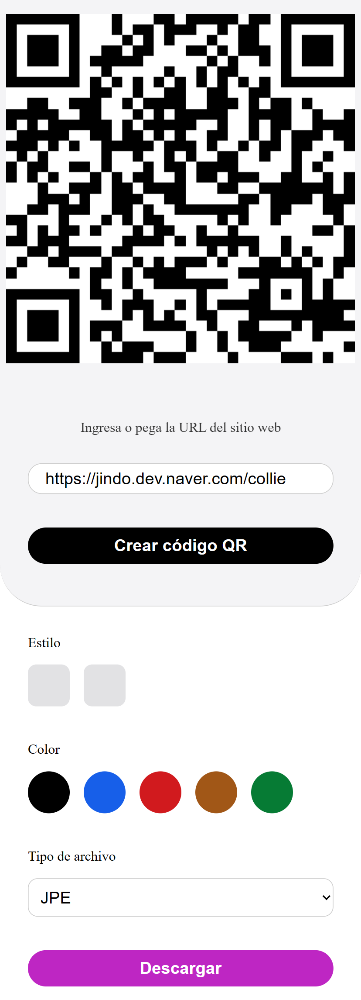

# QRCode

QRCode is Javascript/Typescript library for making QRCode (Only encoding). 
QRCode supports Cross-browser with HTML5 Canvas, SVG and table tag in DOM. 
QRCode has no dependencies.

## Screenshot

<p align="center">
    
</p>

### What is QRCode

QR Code encoding is the process of converting data into a format that can
be stored in a QR Code. The data is encoded in a series of black and white
squares, which are arranged in a specific pattern. The pattern is
determined by the type of data being encoded, the amount of data, and the
error correction level.

## Basic Usages

```javascript
const encode = new QRCode({
    width: 100,
    height: 100
});

encode.drawAt('https://any.text', document.getElementById('root'))
```

or with some options

```javascript
var encode = new QRCode({
	width: 128,
	height: 128,
	colorDark : "#000000",
	colorLight : "#ffffff",
	correctLevel : QRErrorCorrectLevel.H
});

encode.drawAt('https://any.text', document.getElementById("root"))
```

## Browser Compatibility

IE6~10, Chrome, Firefox, Safari, Opera, Mobile Safari, Android, Windows Mobile, ETC.

## License

MIT License
